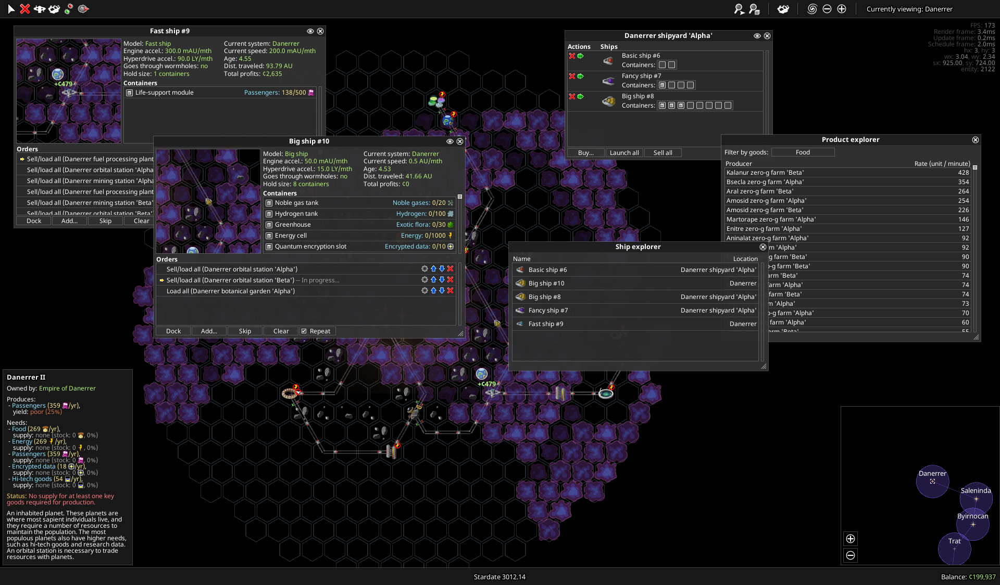

# Screenshots

This page gathers all screenshots of lxgui being used by other projects. If you have an entry you would like to add to this page, please open an issue on github and upload your own screenshot with a description following the examples below!

## Unreleased game

* Author: @cschreib
* Date: 23/10/2021
* lxgui: main (328a259cb1b4d5153c80bf55fab5fc8948a61c9d)
* Url: Not available
* Description: Yet unreleased video game project. The screenshot demonstrates most of the UI elements on a single screen. This is all built with standard lxgui, except the "world frames" (small insets in the two leftmost windows, rendering a region of the game world on top of UI elements). The 2D rendering of the world elements is also done using lxgui's renderer.

